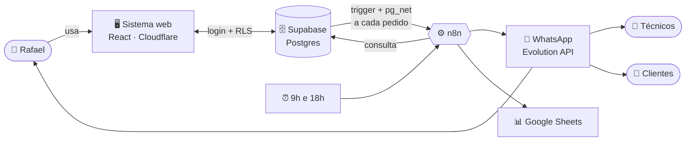
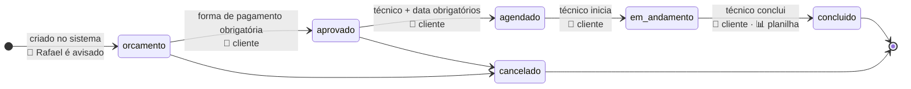
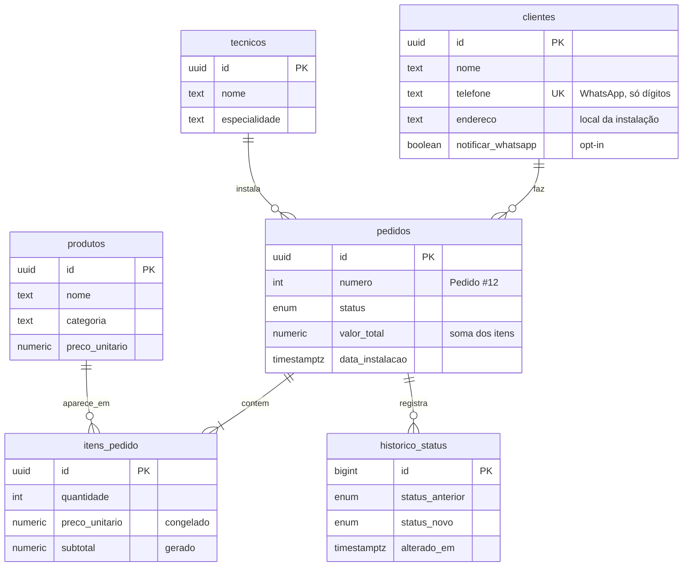

# 🏠 SmartLar · Gestão de pedidos e instalações

Sistema para a **SmartLar**, empresa de automação residencial, parar de usar um caderninho e conversas soltas no WhatsApp como sistema: orçamentos, pedidos, agenda dos técnicos e faturamento num só lugar, e o WhatsApp usado do jeito certo, como canal de aviso para o dono, os técnicos e os clientes.

|  |  |
|---|---|
| 🎬 **Vídeo de apresentação** | [Assistir no Loom](https://www.loom.com/share/697e05485a3a45c89045ed16cab8ef3e) |
| 🌐 **Sistema no ar** | [smartlar.marcofabianufmg.workers.dev](https://smartlar.marcofabianufmg.workers.dev) (acesso enviado no documento de entrega) |
| 🧠 **Decisões técnicas** | [docs/decisoes.md](docs/decisoes.md) |
| ⚙️ **Automações** | [n8n/README.md](n8n/README.md) |
| 🗄️ **Banco de dados** | [supabase/migrations](supabase/migrations) · [dados de exemplo](supabase/seed.sql) |

**Stack:** React + TypeScript + Tailwind/shadcn · Supabase (Postgres, Auth, Vault, pg_net) · n8n · Evolution API (WhatsApp) · Google Sheets · Cloudflare

---

## 🎯 Do problema à solução

O Rafael, dono da SmartLar, tinha cinco dores. O escopo do teste resolvia parte delas; o que faltava para resolver de verdade, eu acrescentei:

| 😩 Dor | 📋 O que o enunciado pedia | ➕ O que eu acrescentei |
|---|---|---|
| Esquece orçamentos que mandou e perde vendas | Lista de orçamentos aguardando aprovação no dashboard | Orçamentos parados há 7+ dias destacados e **lembrete todo dia às 9h** no WhatsApp, com a mensagem de follow-up pronta para cada cliente |
| Não sabe quais instalações estão pendentes na semana | Próximas instalações no dashboard e alerta diário das instalações de amanhã | Alerta no WhatsApp às 18h (avisa também quando não há nenhuma), duração de cada instalação e **bloqueio de conflito de horário** do técnico |
| Não sabe quanto faturou e quanto tem a receber | Indicadores do mês no dashboard; planilha de faturamento como bônus | Bônus entregue: a planilha é preenchida **a cada pedido concluído**, sem duplicar linhas |
| Os técnicos não sabem a agenda sem ligar pra ele | Tela de agenda por técnico | Os técnicos não têm login, então **cada um recebe a própria agenda** no WhatsApp, com endereço, link do Maps, telefone do cliente e o que instalar |
| Clientes ligam perguntando o status | Nada | **O cliente recebe uma mensagem a cada etapa** (aprovado, agendado, em andamento, concluído), se autorizou no cadastro |

Além das dores, também entreguei:

- Login com Supabase Auth, RLS e histórico de status (bônus do enunciado)
- Regras de negócio no banco: total, fluxo de status e conflito de agenda valem para a tela, o n8n e qualquer SQL
- **Nenhum evento se perde:** se o n8n cair, o banco reenvia sozinho até a entrega ser confirmada
- Alerta de falha no WhatsApp para qualquer automação
- Workflows sem nó de código, com notas, tags e versionados no repositório
- Deploy na Cloudflare

---

## 🧭 Como tudo se conecta



- O **banco avisa o n8n** por trigger, sem consulta periódica. A requisição sai só depois do commit, então o n8n sempre encontra o pedido completo.
- **Nenhum evento se perde:** todo evento fica registrado no banco (outbox). Se o n8n estiver fora do ar, o próprio banco reenvia a cada 5 minutos até a entrega ser confirmada.
- As **regras de negócio ficam no banco**: o sistema, o n8n ou um SQL manual passam pelas mesmas validações.

---

## 🔄 A vida de um pedido



O banco **bloqueia** qualquer transição fora desse fluxo (ex: `orcamento → concluido`), e os botões da tela são montados a partir da mesma regra.

---

## 🖥️ Telas

| Tela | O que dá pra fazer |
|---|---|
| 📊 **Dashboard** | Pedidos do mês, faturado, a receber, aguardando agendamento · próximas instalações (7 dias) · orçamentos aguardando aprovação |
| ➕ **Novo pedido** | Busca ou cadastra o cliente na hora · adiciona produtos com subtotal e total ao vivo · observações · salva como orçamento |
| 📋 **Pedidos** | Filtro por status e busca · detalhe com itens, valores e histórico · botões do fluxo (aprovar, agendar, iniciar, concluir, cancelar) |
| 👥 **Clientes** | Cadastro com validação · autorização para avisos no WhatsApp · busca por nome ou telefone · histórico de pedidos de cada cliente |
| 📦 **Produtos** | Catálogo por categoria · cadastro e edição de preço (pedidos antigos mantêm o preço da época) |
| 🔧 **Agenda dos técnicos** | Instalações por técnico e por dia · iniciar e concluir direto da tela · links para Maps e WhatsApp do cliente |

Pensado para funcionar no celular: o técnico usa a agenda em campo.

---

## 🤖 Automações (n8n)

| Quando | O que acontece | Quem recebe |
|---|---|---|
| 🆕 Orçamento criado | Aviso com cliente, itens, total e data | Rafael |
| 🧾 Orçamento criado | O orçamento com itens e total, para aprovar respondendo a mensagem | Cliente que autorizou |
| 📣 Pedido muda de etapa | Mensagem da etapa (aprovado, agendado, em andamento, concluído) | Cliente que autorizou |
| 💰 Pedido concluído | Linha na planilha de faturamento (sem duplicar) | Google Sheets |
| ⏰ Todo dia às 9h | Orçamentos parados há 3+ dias, com link de follow-up | Rafael |
| 📋 Todo dia às 18h | Resumo das instalações de amanhã | Rafael |
| 🔧 Todo dia às 18h | Agenda individual de amanhã | Cada técnico |
| 🚨 Qualquer falha | Workflow, nó, erro e link da execução | Rafael |

Exemplo de mensagem que o cliente recebe ao ter a instalação agendada:

```
Olá, Diego! 📅

Sua instalação está agendada:

🗓️ domingo, 04/10 às 15:30
🔧 Técnico: Lucas
📍 Alameda Santos, 900, ap 141 - Jardim Paulista, São Paulo/SP

Precisa remarcar? É só responder esta mensagem.

Equipe SmartLar
```

Os workflows não têm nó de código, cada um tem notas explicando as etapas, e os JSON ficam versionados em [`n8n/workflows`](n8n/workflows). Detalhes em [n8n/README.md](n8n/README.md).

> 🛡️ **Consentimento:** o cliente só recebe WhatsApp se autorizou no cadastro (*Avisar pelo WhatsApp a cada etapa do pedido*). Sem autorização, como nos clientes fictícios dos dados de exemplo e nos técnicos, a mensagem vai para o grupo do Rafael com o aviso *[Para Fulano]*, nunca para o número.

---

## 🗄️ Banco de dados



`status_transicoes` guarda as 6 transições permitidas: o trigger valida contra ela e o sistema monta os botões a partir dela.

**O que o banco garante sozinho:**

- 🧮 `subtotal = quantidade × preço` (coluna gerada) e `valor_total` = soma dos itens (trigger). Escrever o total na mão é bloqueado.
- 🏷️ O preço do item é **congelado** no momento do pedido.
- 🚦 Só transições de status válidas; aprovado exige forma de pagamento; agendado exige técnico e data.
- 📅 O mesmo técnico não pode ter duas instalações no mesmo horário (cada instalação tem duração estimada).
- 🔒 Itens só mudam enquanto o pedido é orçamento.
- 🕓 Cada mudança de status fica no `historico_status`.
- 📬 Todo evento para o n8n é registrado e reenviado até a entrega ser confirmada.
- 🔐 RLS: só usuário logado acessa os dados.

---

## 📁 Estrutura

```
smartlar/
├── src/                  # Sistema web (React)
│   ├── pages/            #   as 6 telas + login
│   ├── components/       #   layout, tabelas, ações de status
│   └── lib/              #   Supabase, consultas, formatação, tipos gerados do banco
├── supabase/
│   ├── migrations/       # Schema, regras de negócio e gatilhos para o n8n
│   └── seed.sql          # Dados de exemplo (datas relativas ao dia em que roda)
├── n8n/
│   ├── workflows/        # JSON versionado de cada automação
│   ├── build.py          # Gera os JSON
│   └── deploy.py         # Publica no n8n pela API
└── docs/decisoes.md      # Por que cada decisão foi tomada
```

---

## 🚀 Rodando localmente

```bash
npm install
cp .env.example .env.local   # preencha a URL e a chave pública do Supabase
npm run dev
```

| Comando | Para quê |
|---|---|
| `npm run dev` | Sistema em `localhost:5173` |
| `npm run build` | Checagem de tipos + build de produção |
| `npm run deploy` | Build + publicação na Cloudflare |

Banco: aplique os arquivos de `supabase/migrations` em ordem e depois o `supabase/seed.sql`.

---

## 🧪 Roteiro de teste

1. **Clientes → Novo cliente**: cadastre-se com o seu número e marque *Avisar pelo WhatsApp* para receber as mensagens de cada etapa (o telefone aceita qualquer formato).
2. **Novo pedido**: escolha o cliente, adicione 2× *Câmera IP Wi-Fi* + 1× *Sensor de presença* e confira o total: **R$ 1.080,00**. Salve. 📲 *O Rafael é avisado.*
3. **Pedidos → abrir o pedido**: *Aprovar* (pede a forma de pagamento) e *Agendar instalação* (pede técnico, data e duração). 📲 *Cada etapa chega no seu WhatsApp.*
4. **Agenda dos técnicos**: escolha o técnico, *Iniciar instalação* e *Concluir*. 📊 *O faturamento vai para a planilha.*
5. **Dashboard**: o faturado do mês sobe com o valor do pedido.

---

## 📌 Limitações e próximos passos

- WhatsApp via Evolution API (não oficial). Em produção: API oficial da Meta.
- Um único perfil de acesso; técnicos sem login próprio. Próximo passo: papéis (admin/técnico) com RLS por técnico.
- As rotinas agendadas (9h e 18h) não recuperam um horário perdido se o n8n estiver fora do ar naquele momento.

Mais detalhes e o raciocínio de cada escolha em [docs/decisoes.md](docs/decisoes.md).
